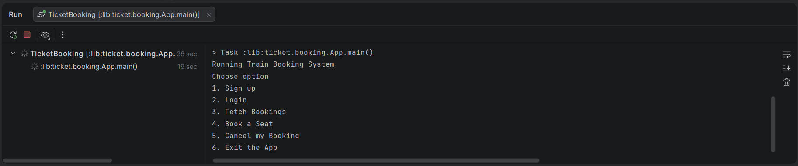

# 🎟️ Ticket Booking System (CLI - Java)

A simple Command Line Interface (CLI) based Ticket Booking System built using Java. This project demonstrates core programming concepts such as user authentication, booking management, and menu-driven interaction.


## 📌 Features

- User Signup
- User Login
- Fetch/View Bookings
- Book a Seat
- Cancel Booking
- Exit Application


## 🖥️ CLI Menu

```
Running Train Booking System

Choose option
1. Sign up
2. Login
3. Fetch Bookings
4. Book a Seat
5. Cancel my Booking
6. Exit the App
```


## ⚙️ Technologies Used

- Java
- CLI (Command Line Interface)
- Object-Oriented Programming (OOP)


## 🧑‍💻 How It Works

### 1. Sign Up
- Create a new user account by providing required details.

### 2. Login
- Authenticate using your credentials.

### 3. Fetch Bookings
- View all bookings associated with the logged-in user.

### 4. Book a Seat
- Select and reserve a seat.

### 5. Cancel Booking
- Cancel an existing booking.

### 6. Exit
- Close the application.


## 📚 Concepts Covered

- Object-Oriented Design
- Encapsulation & Abstraction
- Collections (List, Map, etc.)
- Exception Handling
- CLI Input Handling


## 📸 Screenshot

### CLI



## 🔧 Future Improvements

- Add database integration (MySQL/PostgreSQL)
- Implement seat availability visualization
- Add payment integration
- Convert CLI to REST API or Web App
- Add unit testing